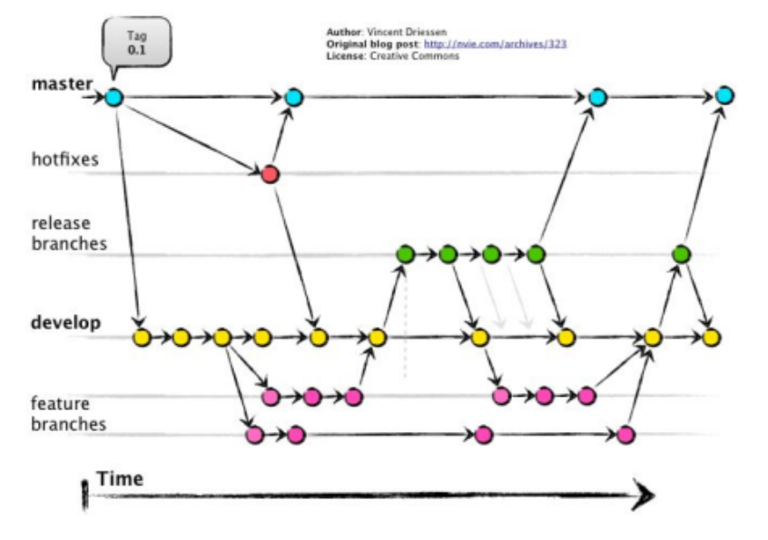

# Repo bài tập môn Thiết kế và xây dựng phần mềm
**Tên sinh viên: Võ Hoài Nam**
**Mssv: 20204592**

Repo tuân theo Release FLow gồm các branch:
- main: deploy
- release: các lab 
- develop: nhánh phát triển
- feature, hotfix, topic, bugfix, refactor, ...

# Week6: FINAL - Thiết kế giao diện cho UC đặt hàng (23/10/2023)
Hoàn thiện phần thiết kế giao diện cho các tính năng liên quan đến đặt hàng, bao gồm: Class diagram, Interaction diagram. Chú ý, thiết kế giao diện bao gồm:
1. Giao diện người dùng (UI) tương tác với Khách hàng
2. Giao diện hệ thống (SI) tương tác với VNPay

Có thể tham khảo trong Assignment 02, phần 2.2. System Interface Design trong folder môn học: https://drive.google.com/drive/folders/16xudhbh-hf5Ypc8hR7FoEvf2SeOufmkp?usp=share_link

